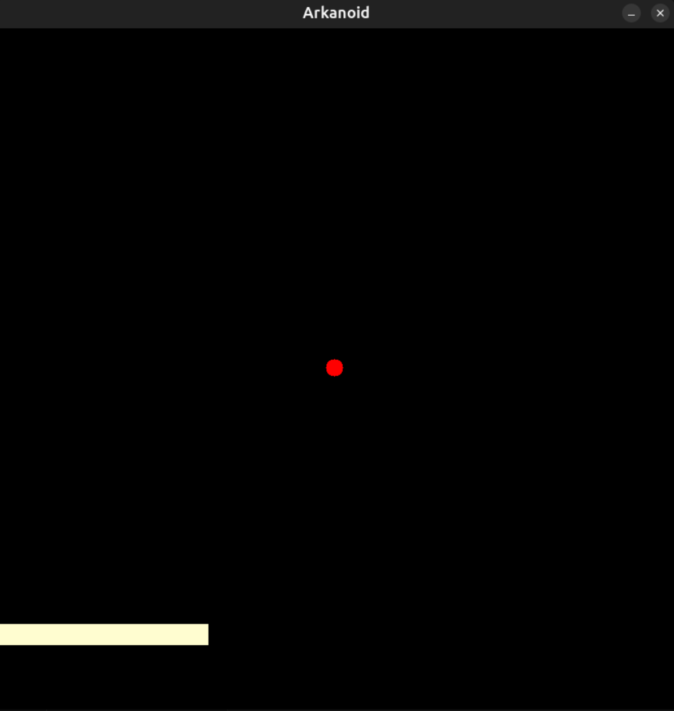

# Arkanoid

Это простая игра "Арканоид", написанная на языке C с использованием библиотеки MiniLibX. В игре вы управляете ракеткой, чтобы отбивать мячик и не дать ему упасть за пределы экрана.

## Особенности

- Управление ракеткой с помощью клавиш-стрелок.
- Обработка столкновений мяча со стенками и ракеткой.
- Завершение игры, когда мячик не отбит.

## Установка и запуск

1. **Клонируйте репозиторий:**

    ```bash
    git clone --recursive https://github.com/afleksik/Arkanoid.git
    ```

2. **Перейдите в директорию проекта:**

    ```bash
    cd Arkanoid
    ```

3. **Установка необходимой библиотеки и зависимостей**
    ```bash
    sudo apt update
    sudo apt install gcc make xorg libxext-dev libbsd-dev
    cd minilibx-linux
    make
    ```

4. **Компиляция и запуск:**
    
    Для компиляции и запуска достаточно сделать следущее:
    ```bash
    chmod +x run
    ./run
    ```

## Управление

- **Стрелка влево:** перемещение ракетки влево.
- **Стрелка вправо:** перемещение ракетки вправо.
- Если мячик не отбит ракеткой и падает за нижнюю границу экрана, игра завершается.

## Пример

<div style="text-align: center;">
    
</div>
